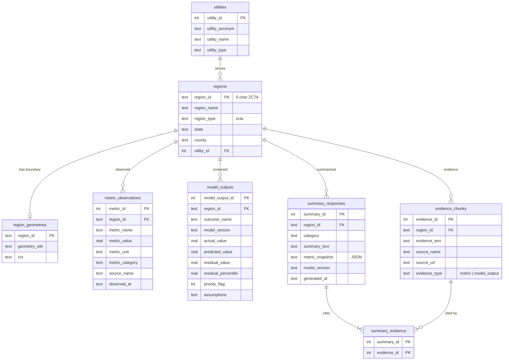

# Architecture

The DER decision-support app answers one question for a California ZIP code (ZCTA):
**how does its distributed-energy adoption compare with what its demographics,
housing, climate, and infrastructure would predict, and what evidence supports that?**

- **User:** an analyst, utility planner, or community-energy advocate deciding where
  outreach or investment for rooftop PV, storage, or EV charging is most needed.
- **Unit of analysis:** the five-character ZCTA, stored as `region_id` everywhere.
- **Core flow:** select a region → retrieve metrics → view model-based screening →
  read a grounded summary with its cited evidence → compare with other regions.

## System

```
Browser (React SPA)                     one container on Render
  │  GET /api/regions, /api/regions/{id},   ┌───────────────────────────────┐
  │      /api/model-output/{id},            │ FastAPI (backend/api)         │
  │      /api/compare, /api/screening       │  ├─ services/regions.py       │
  │  POST /api/summaries ─────────────────▶ │  ├─ services/summaries.py     │
  │                                         │  └─ static frontend/dist      │
  ◀── typed JSON (docs/openapi.json) ────── │        │ read-only SQLite     │
                                            └────────▼──────────────────────┘
                                                 der_tool.db (or fixture)
                                                        ▲
              offline only, never in a request          │
 data/raw ─▶ scripts/rebuild_processed_data.py ─▶ data/processed/*.csv
          ─▶ notebooks/regression.ipynb ─▶ model_outputs_by_region.csv
          ─▶ backend/schemas/build_database.py (stage, validate, publish)
          ─▶ backend/schemas/generate_summaries.py (LLM, explicit command)
```

**Offline/online split.** Everything expensive happens before deployment: data
processing, regression fitting and residual ranking, evidence formatting, and LLM
summary generation. The web server opens the database read-only
(`mode=ro`, `PRAGMA query_only`), never trains, scores, or calls an LLM, and
cannot create or modify a database.

## Repository layout

| Path | Role |
| --- | --- |
| `scripts/`, `notebooks/` | Data processing and offline model pipeline |
| `backend/schemas/` | Database schema, staged builder, offline summary generator |
| `backend/services/` | Query and guardrail logic used by the API |
| `backend/api/` | FastAPI routes (`api.py`) and response contracts (`models.py`) |
| `backend/fixtures/` | Synthetic fixture database for dev, tests, and the demo deploy |
| `backend/serve.py` | Container entrypoint (optional database fetch, then uvicorn) |
| `frontend/` | React + TypeScript app (Vite); types generated from the OpenAPI file |
| `tests/` | Python schema, API, grounding, regression, and deploy tests |
| `frontend/src/__tests__/` | UI unit and integration tests (Vitest) |
| `Dockerfile`, `render.yaml`, `.github/workflows/ci.yml` | Deployment assets |
| `docs/` | This documentation and `openapi.json` |

## Data model

Every table hangs off `regions.region_id`. Metric observations and model outputs
are stored separately; evidence chunks are derived from both; summaries link to the
exact evidence they cite through `summary_evidence`.



Uniqueness constraints keep the key stable: `(region_id, metric_name, observed_at)`,
`(region_id, outcome_name, model_version)`, and `(region_id, category, model_version)`.
The schema lives in `backend/schemas/create_db.py`; `backend/database.py` checks the
required tables and columns, and that core tables are non-empty, at startup and
before a rebuilt database is published.

## Region request path

1. The SPA calls `GET /api/regions/{id}`; the service joins the region, utility,
   metrics (with formatted `display_value`), missing metric categories, and geometry.
2. `GET /api/model-output/{id}` returns stored residuals and priority flags.
3. `POST /api/summaries` returns the stored summary for a category plus the evidence
   it cites, or an explicit `unavailable` status with the retrieved evidence.
4. The SPA renders the map, indicator cards, screening tables, and the summary with
   numbered evidence (`E123`) and source links.
